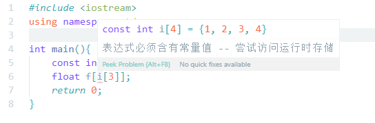
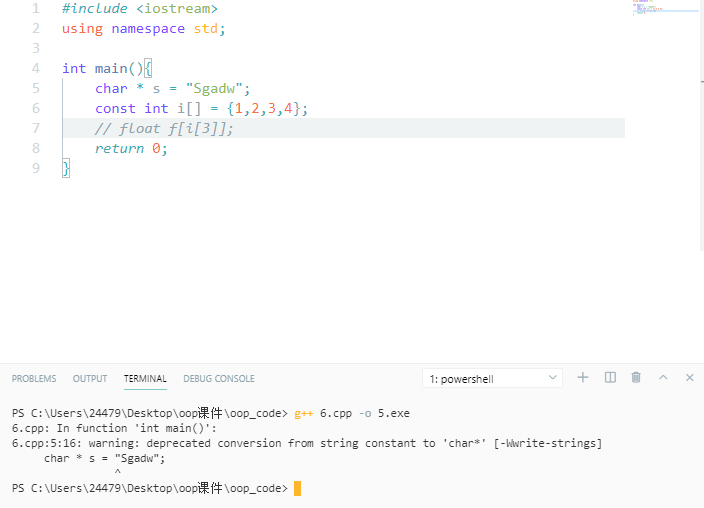

# const

常量的三个用途: 值代替，传参，返回值

声明为 const的变量，编译器不会允许改变其值

## 值代替

> 用来代替宏 define没有明确的类型检查

const变量遵循**变量的作用域原则**，但编译器默认const是内部连接，不会为const变量分配内存，直接把值怼进去。  ——常量折叠

> [!WARNING|style:flat]
>
> 要注意一点是，如果声明了extern const，因为涉及多文件的Link,所以编译器一定会为其创建内存

### 编译时刻的const VS 运行时刻的const

编译时刻的const一定会进行初始化操作，显式的将值表示出来,会被放入编译扫描第一次生成的符号表中，不作为真正变量存在。

而运行时刻的const则会分配其内存空间。

> [!TIP|style:flat]
>
> 如果const int size 不是在编译时有确定值的话，int test[size];会Illegal: 变量size的值不可用作常量

看一段代码

```cpp

#include <iostream>
using namespace std;
class A
{
    const int size;
    int array[size];
public:
    A(int s) : size(s)
    {
        for (int i = 0; i < size; i++)
        {
            array[i] = 0;
        }
        cout << "!!" << endl;
    }
};
int main()
{
    A a(2);
    return 0;
}
```

> [!ERROR|style:flat|label:output]
>
> invalid use of non-static data member 'A::size'

解决方法 make the const value static：

- static const int size = 100;
- enum {size = 100};


类似的，对一整块内存如数组来进行const操作时，编译器也会将其当做运行时const



### :star:  const pointer && pointer const

这里有两种情况 指针是const的 / 指针指向的值是const的

**const 在谁前面，谁就是const的**

- 指向const的指针

  ``` cpp
  const int* u;//理解为: u是一个指针，指向一个const int
  int const*u;
  ```

  > [!TIP|style:flat]
  >
  > int const * u的理解是 u是一个指向恰好是const的 int类型指针，不推荐使用这种形式

- 指针本身是const

  ``` cpp
  int x = 0;
  int * const u = &x;//u是一个指向int类型的const指针
  ```

- 指针和对象都是const

  ``` cpp
  const int * const u;
  int const * const u;
  ```

### 补充条款(

:confused::confused: 关于c++绕来绕去的类型检查 

>[!TIP|style:flat]
>可以把一个非const对象地址赋值给const指针，但是声明了一个const对象，不能把它的地址赋值给普通的指针，因为这样做可能会通过被赋值的指针改变这个对象的值。

## const和函数鬼混

### 传参

表示传入变量的值是不可以改变的

实际上我们如果按值传递，是没卵用的~~

``` cpp
f(int x){
    x--;
     
}
int main(){
    int i = 8;
    f(i);
    return 0;
}
```

学过C语言都知道，传进去的是copy，实际不会改变i的值

所以啊，**传参时候的const 一般都是和引用放一块的**。

### 返回值是const

``` cpp
const int g();
```

> [!TIP|style:flat]
>
> 对于内建类型来讲，不要加const了，也就是给自己提个醒，没卵用
>
> int k = g(); 照样是对的

对于用于定义的类型时，按值返回const类型很重要，如果返回const类型，此函数返回值**不能为左值**

:star: 关于左值: 赋值运算符左边的值叫左值，不能为左值即**不能被赋值，不能被修改**

### const 成员函数

const成员函数不能修改该对象中的任何成员变量

同时，不能调用 non-const 函数

## Tips

- 关于 \*

  \*是与标识符进行结合的，我们经常把 int\*看作一种离散类型。

  ``` cpp
  int *u = &i, v = 0;
  ```

  上面这行代码建立了一个int型指针u和一个 int类型的v。

- char \*  VS char[]

  爷在C语言的熏陶下，觉得这两个东西一模一样。

  

  这里声明的字符数组的字面值 "Sgadw"被编译器作为const的字符数组建立，相当于把const对象的地址给了非const的指针，所以会有这个warning。

  因此，我们如果想声明一个可修改的字符串，最好把它放到数组中，也就是使用 char[]

  char s[] = "Sgadw";

  