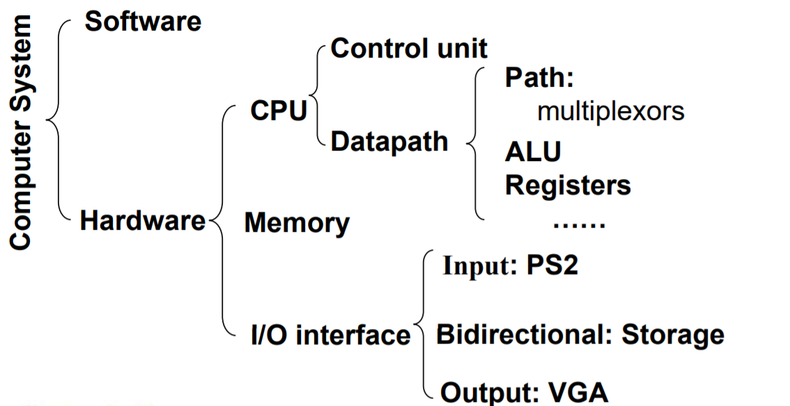

### Chapter 1 综述(无重点)

#### 计算机组成核心内容

1. 处理器内核结构以及在程序性能上带来的影响

2. 软件和硬件的层次构架
   - 高级语言如何转换成硬件语言，高级语言是怎么运行的？
2. 软件和硬件之间的接口是什么， 软件如何指示硬件执行？
   - 什么决定了一个程序的性能？
   - 可以使用哪些技术来提高性能？
   - 我们如何用硬件实现一个计算机系统?

#### 计算机系统的层次结构

#### 软件的分类

- 系统软件
  - 编译器
  - 操作系统
  - 汇编语言
- 应用软件

#### 8个伟大的思想

- 摩尔定律设计
- 使用抽象简化设计(减小开销)
- 使普遍事件处理度更快(common case 发生概率很高)
- 采用并行方式改善性能(空间换时间)
- 通过流水改善性能(*预测)
- 存储器层次结构
- 通过冗余提高可靠性

#### 我们在课程中需要实现的计算机系统

- CPU
  - MIPS构架(基本要求18条指令)：datapath,controller
- 存储器
  - IP core
- 外围设备
  - input :SW,BTN
  - output:VGA,7段数码管
  - 辅助模块：防抖动等等

#### (-)VGA

扫描：

**显示器来同步驱动电路**，注意有过冲

#### 附一个例子，20条指令的cpu

